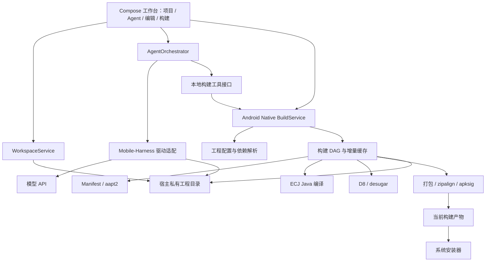

# Forge Mobile：AIDE 原生编译引擎 + Mobile-Harness Agent 整合 Spec

版本：0.2（方案草案）  
日期：2026-09-27  
状态：设计基线；执行中。P0 原生编译链已在 Android 16 真机跑通，详见 [P0 执行记录](../progress/P0-native-build.md)。

## 1. 目标与硬约束

在一个 Android 应用中完成「描述需求 → Agent 修改源码 → 本机构建 APK → 诊断与修复 → 审阅差异 → 安装运行」。模型推理默认通过用户配置的 API 完成，Agent 编排与应用编译在手机本地完成。

用户指定的架构约束：

- 不使用 Termux，包括独立 Termux 应用、AIDE-Termux 模块及其 bootstrap。
- Android 应用编译采用 AIDE-CN 路线：内置构建服务直接调度编译、资源处理、Dex、打包和签名工具。
- 编译链不运行在 PRoot/Ubuntu 中，不以 Gradle CLI 作为默认执行器，也不在失败时自动回退到这条路线。
- Mobile-Harness 提供 Agent 会话、驱动抽象、文件操作与交互基础；其现有 Gradle 编译入口由新的原生 BuildService 替换。
- 优先优化增量构建和进程启动开销，性能收益必须通过同设备、同工程测量确认。

这里的“原生构建”指直接在 Android 宿主环境中执行构建服务与适配工具，不表示所有编译器都必须用 C/C++ 实现。ECJ/D8 等 Java 实现的工具需要验证在 Android ART 上的可运行形式。

## 2. 仓库结论与依据

| 仓库 | 已核实的事实 | 用途 |
|---|---|---|
| AIDE-Pro-Release | 当前 main 只有 README，已归档；提供 APK 发布 | 功能和迁移参考，不能直接合并 IDE 源码 |
| AIDE-Plus | README 宣布闭源，仅发布 APK；列出 ECJ、aapt2、D8、Gradle 解析器、Maven 下载器、签名和资源对齐能力 | 原生构建路线参考；具体实现仍需历史源码或接口验证 |
| AIDE-Termux | 有终端源码和二进制依赖 | 根据用户要求不纳入产品 |
| resource | Releases 包含 SDK、JDK、Gradle、NDK 等包 | 只筛选原生构建真正需要且通过来源/ABI 验证的资源，不整体安装 |
| Mobile-Harness | 已有 AgentRegistry、驱动、PRoot 运行时、Gradle 构建与 APK 安装流程；主工程 MIT | 复用 Agent 与产品基础，替换 Android 构建执行层 |

固定调研基线：

- Mobile-Harness：`15177fcb12bbd2afc8e281a79fb8185bb5daa5b8`。
- AIDE-Pro-Release：`fb4bc6a3ded0e9dc5a874b897777370c2e9be0d6`。
- AIDE-Plus：`22dd2633e253f7ffd8205764409c5d65d4a60f98`。
- resource：`6fa0b2a387392982ba1352d4843ad8c7d7dd464f`。

AIDE-Plus 文档中的历史 CMake 提交链接本次访问返回 404，对应 Git tree API 返回 422。尚未取得可审计、可复现的 AIDE 构建核心源码。不能仅凭功能列表宣称已掌握 AIDE 完整实现，也不能假定当前 APK 提供编译 RPC。

## 3. 整合路线与实施门槛

首选是取得可复现的 AIDE 历史构建模块，在核对源码来源、依赖与许可后抽离为 NativeBuildEngine；若无法取得，则按其公开工具组合设计兼容实现。后者应明确标注“采用 AIDE 同类原生构建路线”，不能称为已复用 AIDE 原构建引擎。

P0 必须给出以下两项结论：

1. 能否取得并独立构建真正的 AIDE 构建模块；能复用到何种程度。
2. 若只能实现兼容引擎，ECJ/aapt2/D8/签名工具能否在 Android 宿主上跑通最小 APK，支持范围是否满足产品目标。

若两项均无法成立，输出具体阻塞点并调整计划；不擅自改回 Termux 或 PRoot 编译。历史 AIDE-Plus README 说明其历史版本采用 AGPLv3，具体复用版本的文件级许可与第三方来源需逐项落实。Mobile-Harness 的 MIT 许可不覆盖其他仓库和预编译工具。

## 4. 产品范围

### 首版必须支持

- ARM64 Android 手机，单应用、无需 root。
- Java + XML Android 项目创建与导入。
- 明确定义的 Gradle Groovy DSL 静态子集，用于读取项目配置，不启动 Gradle。
- Android SDK API、资源、Manifest、常见 JAR/AAR 依赖和单应用模块。
- Agent 读写文件、调用原生构建、获取诊断并有限次自动修复。
- 实时阶段日志、错误定位、取消、增量编译、精确产物归属。
- Debug APK 打包、签名、导出与系统安装。
- AIDE 项目兼容报告及可审阅迁移，不隐式更改工程语义。

### 后续阶段

- 多模块依赖图、BOM 与复杂依赖规则。
- Kotlin：先验证可运行编译器、Java/Kotlin 混编和运行库，再加入支持矩阵。
- ViewBinding、注解处理、DataBinding：作为独立能力实现，不能视为跳过 AGP 后自动具备。
- Compose、KSP/KAPT、NDK/CMake、release 优化及 AAB。
- 更完整的编辑器、补全与语言服务。

不承诺任意 Gradle 脚本、AGP 插件或 Android Studio 工程原样兼容。首版明确不执行自定义 Gradle Task、任意 buildSrc/convention plugin 或 Kotlin DSL 脚本；检测到后展示阻塞原因。

## 5. 架构与职责



建议逻辑模块：

| 模块 | 责任 |
|---|---|
| workspace | 工程身份、目录映射、保存、快照、导入导出 |
| agent-core | 驱动、会话、工具调用、修复预算和取消 |
| build-model | 配置解析、标准化模块模型和不支持项检测 |
| dependency-resolver | Maven/POM、JAR/AAR、缓存与依赖图 |
| build-engine | 构建 DAG、阶段调度、增量失效、事件和诊断 |
| build-tools | ECJ/aapt2/D8/打包/签名的 Android 适配 |
| artifacts | 产物索引、摘要与构建来源 |
| installer | 系统安装及独立结果状态 |

构建服务放入专用 Android 进程，例如 `:builder`，与 UI 通过 Binder 通信；大量日志写入文件并发送增量事件，避免 Binder 大消息。它用于生命周期管理与故障隔离，不应称为同 UID 下的强安全隔离。

### Agent 运行环境

不引入 Termux。Mobile-Harness 的 PRoot 可以作为现有 CLI Agent 的可选运行后端，但不安装其 Android Gradle 工具链，也不参与任何 APK 编译阶段。

优先评估保留现有 Agent CLI 驱动的最小变更方案；如果产品进一步要求完全没有 Linux 用户空间，则需另行实现 Android 原生 API Agent 循环。后者不是直接复用 CLI 驱动，工作量与兼容范围单独计算。

两种 Agent 后端都通过同一个受管理的 Build API 调用 Android 宿主构建服务。Agent 工具说明明确禁止用 Shell 启动 Gradle 替代本机编译器，首版支持矩阵只承诺受管理路径。

## 6. 原生构建流水线

以下为拟议流水线，具体阶段顺序由依赖 DAG 决定；不是对 AIDE 未公开实现的逐行还原。

1. **工程建模**：解析 Android 配置，生成 applicationId、SDK、源码目录、资源目录、依赖和变体模型。
2. **依赖解析**：读取 Maven POM、处理支持的依赖规则，下载并缓存 JAR/AAR；解包 AAR 资源、Manifest、classes.jar 与 native 库。
3. **资源和清单**：合并 Manifest，使用 Android ARM64/Bionic aapt2 编译变化资源并链接；生成对应 R 源码/资源符号与资源包。
4. **源码准备**：生成 BuildConfig；建立包含 android.jar、依赖、R 的编译 classpath。
5. **Java 编译**：调用适配 Android 的 ECJ 生成 class，记录结构化编译错误。
6. **Dex**：调用适配后的 D8，按 minSdk 处理 desugar 与 multidex；核心库 desugaring 仅在相关库和规则验证后启用。
7. **APK 组装**：合并资源包、Dex、assets 与 ABI 对应 native 库，处理重复条目和排除规则。
8. **对齐与签名**：zipalign 后通过 apksig 等经验证实现签名；验证签名与 ZIP 对齐。签名后不再修改 APK。
9. **归档与安装**：生成产物摘要和来源记录，通过系统安装器提交，独立跟踪安装结果。

ECJ、D8、Manifest merger、apksig 的 Java 字节码不能直接假定在 ART 上运行：需要验证 DEX 转换、缺失 Java API、反射、内存以及线程/进程行为。aapt2/zipalign 需要验证 ABI、Bionic、动态依赖及当前 Android 的执行路径限制。

原生可执行工具优先作为经验证的 APK 原生组件打包；不得假定下载到 filesDir 后 chmod 即可执行。支持哪些 targetSdk/Android 版本由真机实验决定。

初期保守支持 Java 8 源码特性与经过验证的字节码目标；AIDE 文档列出的 Java 23 能力不直接作为本产品承诺。

## 7. Gradle 配置兼容边界

读取 build.gradle 仅用于兼容已有工程声明，不执行 Gradle，也不意味着实现完整 Groovy。

首版静态子集：compileSdk、minSdk、targetSdk、namespace/applicationId、基础 sourceSets、固定版本 implementation/api/compileOnly/runtimeOnly、基础 buildTypes 和本地 JAR/AAR。每一项都需明确作用域与测试样例。

支持语法通过解析器转换为统一 ProjectModel；遇到变量求值、条件逻辑、动态版本、插件生成配置或不认识的 DSL 时返回定位信息，不使用正则猜测后静默构建。可让用户将必要配置显式写入 `.forge/project.json`，保留原工程文件。

兼容报告包含：可支持项、需迁移项、阻塞项、变更预览。依赖解析必须明确传递依赖、冲突策略、exclude、compile/runtime 作用域和 AAR 资源优先级；首版无法处理的规则必须阻塞，不能忽略。

## 8. 增量编译与性能

- 资源缓存按内容摘要、aapt2 版本、参数与 SDK 版本建立键；资源变动先增量 compile，必要时重新 link。
- Java 阶段初期采用模块级失效保证正确性；建立依赖关系后再引入文件级增量，不能只编译修改文件而漏掉依赖类。
- Dex 可预先缓存不变依赖，工程变化触发对应重建；工具版本、minSdk、desugar 规则改变必须失效。
- 所有删除、重命名、Manifest/SDK/classpath/配置变更进入失效规则，避免旧 class、旧资源残留。
- 相同工程不并发构建；可独立资源步骤采用受内存预算限制的并行，重型编译阶段默认串行。
- 构建进程可短期保持热态，但空闲后释放；进程被杀后从已校验的阶段缓存恢复，不把未完成文件当成有效缓存。

性能验收使用同一台设备、同一份 Java/XML 项目，对比 AIDE 实际构建：首次构建、热态无改动、单 Java 修改、单 XML 修改、依赖变化。记录各阶段耗时、峰值内存、产物大小和安装结果，每种场景至少重复 5 次，区分下载与纯编译耗时。

目标是在同等产物与编译配置下接近 AIDE 的交互速度。P0 建立基线后给出量化门槛；本 Spec 不虚构速度倍数，也不把全部耗时归因于终端软件本身。

## 9. 工具接口与状态

```text
inspect_project(projectId) -> ProjectModel + CompatibilityReport
check_native_toolchain(profileId) -> HealthReport
start_build(projectId, variant, mode, sourceSnapshotId) -> buildId
get_build(buildId, afterSequence) -> BuildSnapshot + events
cancel_build(buildId) -> cancellationRequested
list_artifacts(buildId) -> Artifact[]
request_install(artifactId) -> installRequestId
```

mode 首版为 debug；clean 为单独受管理操作。Agent 不能传入任意构建 Shell 字符串。

BuildRequest 记录项目、快照、配置、工具版本与调用者。事件记录 buildId、递增序号、阶段、时间与 payload。Diagnostic 记录严重性、文件、行列、消息与原始日志位置。Artifact 记录 buildId、路径、SHA-256、applicationId、variant 与源码快照。

状态：`QUEUED → CHECKING → RESOLVING → BUILDING → PACKAGING → SUCCEEDED`；异常转为 FAILED、CANCELLED 或 INTERRUPTED。取消请求进入 CANCELLING，子进程/编译服务确认停止后才结束。无法安全中断的嵌入式编译器可通过终止独立 builder 进程取消，缓存写入使用暂存文件和原子提交。

安装状态独立：USER_ACTION_REQUIRED、INSTALLED、REJECTED、FAILED。APK 生成不等于安装或启动成功。

## 10. 文件一致性与自动修复

工程保存于应用私有目录；SAF 导入采用复制，导出显式执行。Agent 与 builder 访问同一宿主数据，PRoot 后端只做该工程的路径映射。

构建前保存编辑器缓冲区并建立快照。首版暂停 Agent 修改回合后执行构建；检查构建前后输入摘要，变化时将结果标为失效。应用级锁不能阻止同 UID 下任意 Shell 写入，不应把它当作安全边界。

Agent 闭环：检查环境 → 建立检查点 → 修改代码 → 调用原生构建 → 获取诊断 → 修复 → 重建，默认最多 3 轮。重复错误、环境不支持、预算耗尽时停止并保留日志；不切换到 Gradle。

回滚只还原本任务修改，保留用户之前的未提交内容。诊断输出视为数据，不当成新的指令执行。密钥不进入构建日志、项目导出或模型上下文。

每次产物归档到 buildId 专属目录；禁止遍历全工程选择“最新 APK”。工具链配置包含工具来源、版本、ABI、摘要、许可与健康状态，更新后缓存自动失效，失败可回滚。

## 11. 复用与改造清单

| Mobile-Harness 组件 | 改造 |
|---|---|
| AgentDriver / AgentRegistry | 保留抽象，增加原生 Build API 工具适配 |
| Agent runtime bridges | 保留会话能力，替换 Android 环境提示和构建指导 |
| MainViewModel.buildAndRunAndroidApp | 移除 Gradle 命令和按时间挑 APK，改为构建服务调用 |
| RuntimeInstaller | Agent 环境与 Android 原生工具安装分离；不安装旧 Gradle Android stack |
| AndroidAppInstaller / Receiver | 复用系统安装流程，按 artifactId 关联结果 |
| 项目/编辑/差异 UI | 增加兼容报告、构建阶段、诊断与产物视图 |
| 更新与应用身份 | 使用自身包名、签名、authority 和更新源 |

工具链和构建逻辑不得继续集中于 ViewModel。宿主 APK 的开发构建仍可在开发者电脑上使用 Gradle；该限制针对手机上编译用户项目，二者应明确区分。

## 12. 分阶段计划

| 阶段 | 交付 | 退出标准 |
|---|---|---|
| P0 原生链验证 | AIDE 可复用性报告；工具适配实验；性能基线 | 不安装 Termux、不启动 PRoot/Gradle 的条件下，构建并安装最小 Java/XML APK |
| P1 编译内核 | 工程模型、Maven/AAR 基础、ECJ/aapt2/D8/打包签名 | Java/XML、外部 JAR/AAR 样例通过，错误可定位，产物来源准确 |
| P2 Agent 整合 | Build API、诊断、检查点、重试预算 | Agent 修改→原生编译→修复→APK 闭环通过 |
| P3 增量与迁移 | 缓存 DAG、兼容报告、AIDE 样例、性能报告 | 删除/重命名等无脏产物，热构建达到 P0 定义门槛 |
| P4 能力扩展 | Kotlin/多模块/ViewBinding/NDK 分项验证 | 逐项通过后才加入支持列表 |

必须先通过 P0 再投入大规模界面开发。若无法复用 AIDE 核心，兼容引擎是实质性编译系统开发，不能按“拼接两个应用”估算。工期在 P0 后根据源码可用性和工具运行情况给出。

## 13. 验收清单

1. 全新设备未安装 Termux，产品包不含 AIDE-Termux/Termux bootstrap。
2. 关闭 Agent Linux 后端后，单独点击原生构建仍能生成 APK；进程记录不出现 Gradle/PRoot 编译步骤。
3. Java/XML、AndroidX AAR、资源引用、Manifest 合并、Dex 与安装验证通过。
4. 修改、删除、重命名 Java/资源文件后结果正确；clean 与增量构建产物行为一致。
5. 不支持的 Gradle DSL、插件和 Kotlin 项目返回明确兼容错误，不静默生成错误 APK。
6. Agent 注入错误后能获取定位；达到重试上限必须停止；失败不触发 Gradle 后备路径。
7. 取消或杀掉 builder 后无伪成功，缓存保持完整，重试有效。
8. 老 APK、其他变体、其他项目产物不会被误安装。
9. 安装被用户拒绝时，构建成功与安装拒绝分别呈现。
10. ZIP 导入阻止路径穿越；异常工程路径不会越界读写。
11. 至少覆盖两类厂商设备；Android 版本及 targetSdk 逐项记录工具执行结果。
12. 同设备与 AIDE 的冷/热构建性能有可复查记录，性能结论不依赖主观感觉。

## 14. 来源与验证范围

- [AndroidIDE-CN 组织](https://github.com/AndroidIDE-CN/)
- [AIDE-Plus 公告及构建能力说明](https://github.com/AndroidIDE-CN/AIDE-Plus/blob/22dd2633e253f7ffd8205764409c5d65d4a60f98/README.md)
- [AIDE-Pro-Release](https://github.com/AndroidIDE-CN/AIDE-Pro-Release)
- [工具资源 Releases](https://github.com/AndroidIDE-CN/resource/releases)
- [Mobile-Harness 固定源码基线](https://github.com/techjarves/Mobile-Harness/tree/15177fcb12bbd2afc8e281a79fb8185bb5daa5b8)
- [现有构建入口](https://github.com/techjarves/Mobile-Harness/blob/15177fcb12bbd2afc8e281a79fb8185bb5daa5b8/app/src/main/java/com/jarves/mh/ui/MainViewModel.kt)
- [现有 Agent 抽象](https://github.com/techjarves/Mobile-Harness/blob/15177fcb12bbd2afc8e281a79fb8185bb5daa5b8/app/src/main/java/com/jarves/mh/runtime/AgentDriver.kt)

本文件中的模块、接口、流水线与阶段为设计要求。AIDE 原生工具组合有 README 支持，但其精确内部实现与可提取源码仍待验证。原生链路的实际实现、真机数据和剩余工作以 [P0 执行记录](../progress/P0-native-build.md) 为准；不能将最小样例通过解释为全部设计已经完成。
